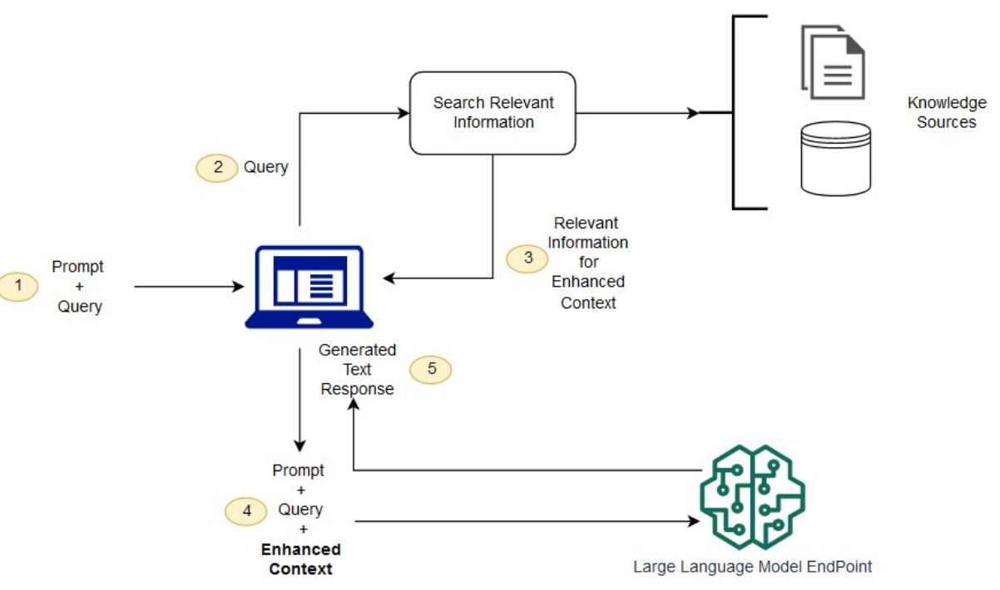
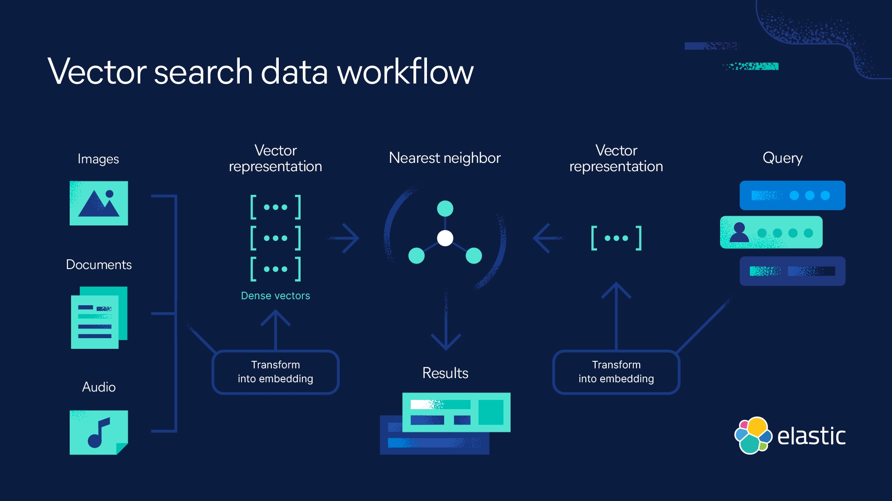

# LLM Optimization

## LLM의 문제점
1. 사실성 문제 - 질문에 대한 답변이 없는 경우 실존하지 않는 답변을 생성할 수 있다
2. pre-trained dataset을 사용하기에 최신 정보가 없을 수 있다
3. 주로 general한 data로 훈련되기에 특정 분야의 세부 정보가 부족할 수 있다

#### LLM 개선 방안
- RAG : Retrieval Augmented Generation
- Semantic Search
- Fine Tuning

## RAG란?

1. 사용자가 질문(prompt) 입력
2. 외부 소스(인터넷, private DB, 업로드된 문서, etc)에서 데이터 수집
3. prompt 및 수집된 데이터를 토대로 LLM이 답변을 생성

#### RAG 장점
1. 모델의 재학습 필요 X
2. 가장 최신 데이터를 가져올 수 있다
3. LLM이 학습된 데이터 기반의 기억으로 답변을 생성하는것이 아닌 evidence 기반의 답변 생성
4. 다양한 외부 소스를 통하여 유연한 시스템 구축 가능

## Semantic Search란?

- 단순 키워드 일치를 넘어, 의도와 문맥을 통해 가장 관련성 높은 문서를 검색 (matching concept rather than keywords)
- 구성 요소 : 
  - Embedding Model : 쿼리를 벡터 형태로 변환
  - Vector DB
  - Similarity Search Algorithm : k-NN, cosine similarity, dot product, etc

#### Semantic Search 장점
1. 정확도 : input query의 의도를 파악함으로서 더욱 관련성 높은 답변 제공
2. 효율성 : 기존의 keyword-based search에 비해 관련성 높은 정보를 가져오는 것이 빠르다
3. 다방면으로 쓰이기 좋다. (웹 검색, 챗봇, e-commerce, etc)

## Fine-tuning이란?

- Transfer Learning의 일종
- pre-trained LLM을 특정 작업이나 도메인에 맞게 추가 학습을 진행하여 성능 향상
- 주요 방식 :
  - Full Fine-Tuning : 모델의 모든 파라미터를 업데이트 - 높은 성능 제공, 많은 자원 소모 및 기존 지식 유실 가능
  - Parameter Efficient Fine-Tuning : 모델의 일부 파라미터만 업데이트 - 효율적 튜

## RAG vs Semantic Search vs Fine-Tuning

| 항목                  | **RAG** (Retrieval-Augmented Generation)                | **Semantic Search**                                        | **Fine-Tuning**                                               |
|-----------------------|----------------------------------------------------------|-------------------------------------------------------------|---------------------------------------------------------------|
| **핵심 개념**         | 검색 + 생성 결합 (외부 지식 기반 생성)                  | 의미 기반 유사 문서 검색                                    | 모델 자체를 도메인에 맞게 추가 학습                          |
| **지식 최신성**       | ✅ 최신 정보 반영 가능 (DB, 웹 등)                       | ✅ 최신 문서 검색 가능                                       | ❌ 학습 시점 이후 정보는 포함되지 않음                        |
| **출처 제공 가능**    | ✅ 문서 기반 응답 생성 가능                              | ✅ 검색 결과 제공                                            | ❌ 내재화된 응답, 출처 명시 어려움                            |
| **속도**              | 중간 (검색 + 생성 단계 필요)                            | ✅ 빠름 (단순 벡터 비교)                                     | ❌ 느림 (학습 및 서빙 비용 발생 가능)                         |
| **도메인 특화성**     | 중간 (문서 품질/구성에 의존)                            | 중간 (임베딩 품질에 의존)                                   | ✅ 매우 높음 (도메인 지식 모델에 내재화됨)                    |
| **유지보수**          | ✅ 문서 업데이트만으로 최신화 가능                       | ✅ 문서만 갱신하면 됨                                        | ❌ 모델 재학습 필요                                            |
| **사용 사례**        | 복잡한 질문 응답, 챗봇, 고객지원                         | 추천 시스템, FAQ 검색, 법률 문서 검색                        | 챗봇, 커스터마이징된 문체 응답, 전문 분야 LLM                 |

#### Reference
https://aws.amazon.com/ko/what-is/retrieval-augmented-generation/
https://aws.amazon.com/ko/blogs/tech/amazon-opensearch-services-vector-database-capabilities-explained/
https://tsaiprabhanj.medium.com/rag-vs-semantic-search-a-deep-dive-for-generative-ai-0ada1e2d7cd0
https://www.elastic.co/what-is/semantic-search
https://medium.com/@naveenjothi040/semantic-search-with-llms-3661fd2a9331
https://docs.aws.amazon.com/sagemaker/latest/dg/model-parallel-core-features-v2-fine-tuning.html
https://platform.openai.com/docs/guides/fine-tuning
https://www.ibm.com/think/topics/fine-tuning
https://youtu.be/00Q0G84kq3M?si=4Feh-CR-I9EmS8oX
https://www.youtube.com/watch?v=zYGDpG-pTho&t=1s
https://www.youtube.com/watch?v=T-D1OfcDW1M

