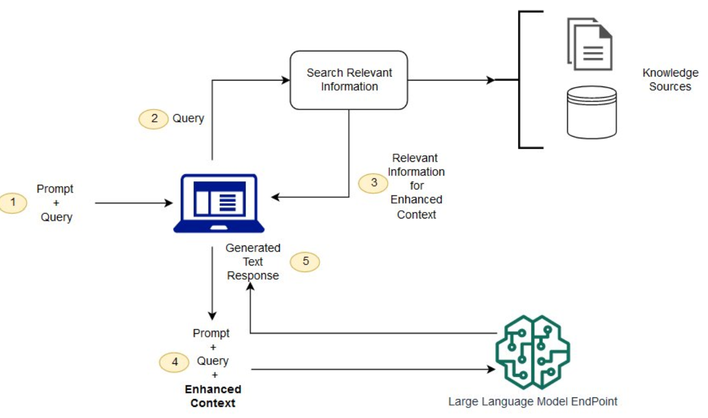

# RAG vs Fine-tuning vs Semantic Search

## LLM의 문제점
1. 사실성 문제 - 질문에 대한 답변이 없는 경우 실존하지 않는 답변을 생성할 수 있다.
2. pre-trained dataset을 사용하기에 최신 정보가 없을 수 있다.
3. 주로 general한 data로 훈련되기에 특정 분야의 세부 정보가 부족할 수 있다.

#### LLM 개선 방안
- RAG : Retrieval Augmented Generation
- Fine Tuning
- Semantic Search

## RAG란?

1. 사용자가 질문(prompt) 입력
2. 외부 소스(인터넷, private DB, 업로드된 문서, etc)에서 데이터 수집
3. prompt 및 수집된 데이터를 토대로 LLM이 답변을 생성

#### RAG 장점
1. 모델의 재학습 필요 X
2. 가장 최신 데이터를 가져올 수 있다
3. LLM이 학습된 데이터 기반의 기억으로 답변을 생성하는것이 아닌 evidence 기반의 답변 생성
4. 다양한 외부 소스를 통하여 유연한 시스템 구축 가능
