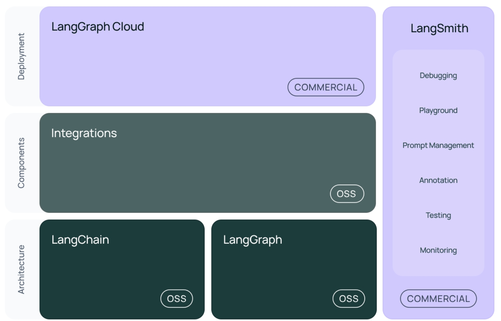
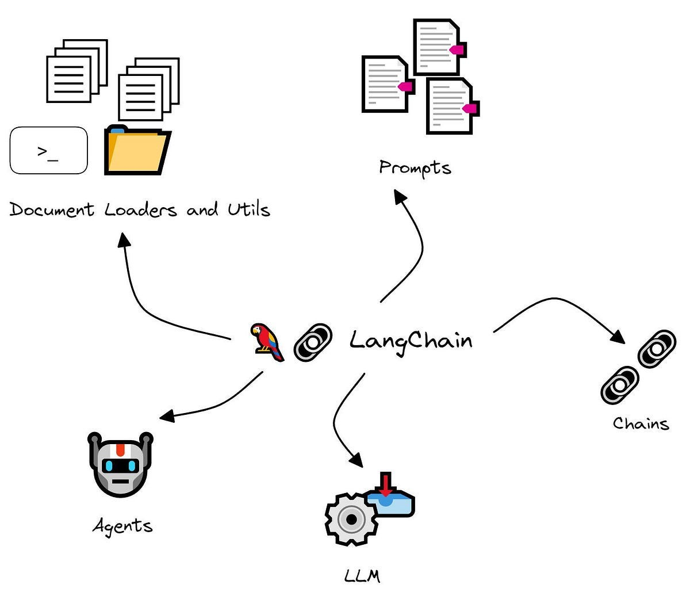
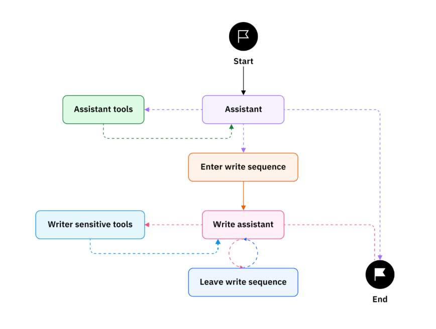

# LangChain이란?
- 대규모 언어 모델(LLM)을 활용한 애플리케이션 개발에 특화된 오픈소스 프레임워크  
- 기존의 언어 모델이 주로 텍스트 생성에 중점을 둔 반면, LangChain은 다양한 외부 데이터 소스와 통합하여 보다 복잡하고 유용한 애플리케이션을 만들 수 있도록 설계  

- Chain이란? 여러 단계의 구성 요소를 하나로 묶은 논리적 파이프라인
  - Chain structure : DAG (Directed Acyclic Graph)
    
#### 작동 방식
1. Retreive data            <- Document Loader / Text Spliter
2. Summarize the data       <- Chain of [prompt, LLM]  
3. Answer user's prompt     <- Chain of [Memory(conversation history), prompt, LLM]

#### 장정 
- 추상화를 통해 LLM 앱의 프로그래밍을 간소화 : LLM의 세부적 이해도 필요 X
- 다양한 언어 모델과 쉽게 통합 가능 -> 복잡하고 다양한 앱 구축
- prompting, context 관리, fine-tuning 등의 기능 제공을 통해 앱의 동작을 세밀하게 조정할 수 있는 높은 유연성

#### 단점
- 매우 복잡한 앱 구축시, 성능 저하 발생 가능 -> 다수의 외부 데이터 소스와 통합되면서 발생하는 추가적인 연산 부담 (하드웨어 리소스 또는 코드 최적화 필요)

#### 활용 사례
- Morningstar : 금융 서비스 제공업체의 방대한 재무 보고서와 시장 데이터를 분석하고, 이를 바탕으로 사용자 맞춤형 금융 인사이트를 제공하는 AI engine 개발
- Elastic software: 보안 분석가들을 지원하기 위해 AI 어시스턴트 개발. 보안 경고를 요약하고, workflow를 제안하며, 쿼리 생성과 변환 수행하여 보안 팀의 업무 효율성 향상.

# Langgraph란?
- specialized library within LangChain to build stateful multi-agent systems
- process input : add task, complete task, summarize task : total of 3 nodes and connected with edges
- 일반적인 그래프 구조를 사용하여, **복잡한** 제어구조 표현 가능 : ex) 반복처리, 분기처리 
- 구조 : Stateful graph, Cyclical graph, Nodes, Edges
- Stateful Multi-Agent System 설계 

#### References & 추가 자료
https://python.langchain.com/docs/introduction/  
https://www.samsungsds.com/kr/insights/what-is-langchain.html  
https://langchain-ai.github.io/langgraph/concepts/why-langgraph/  
https://www.ibm.com/think/topics/langgraph  
https://brunch.co.kr/@zer0cero/132  
https://aws.amazon.com/ko/what-is/langchain/  
https://www.youtube.com/watch?v=qAF1NjEVHhY  
https://www.youtube.com/watch?v=1bUy-1hGZpI&t=6s  
https://www.youtube.com/watch?v=yMalr0jiOAc    <---------  보기
