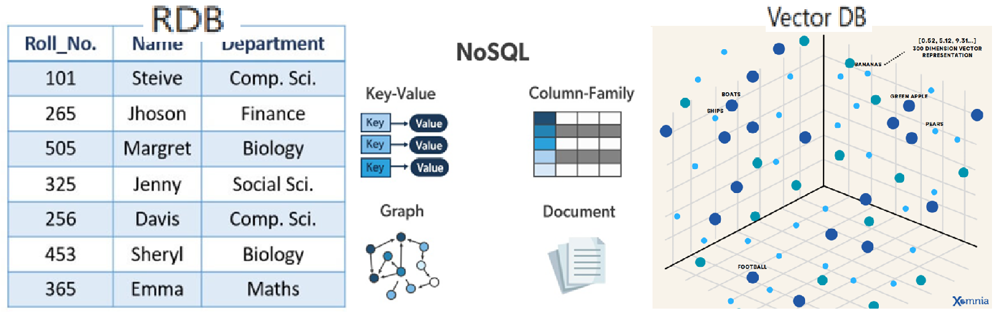
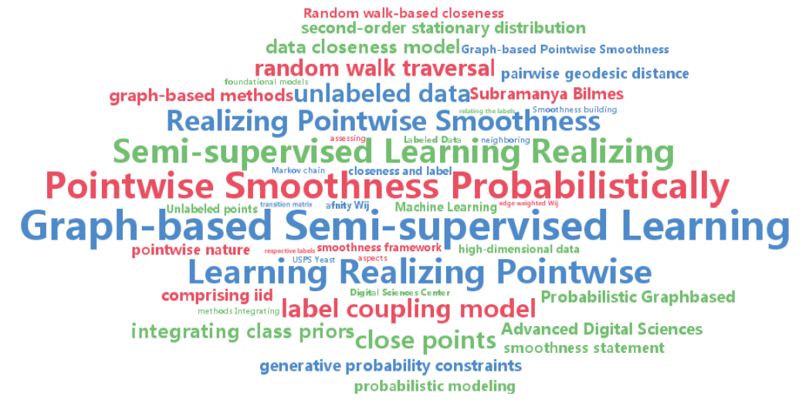

# Vector DB

데이터 형태 : 정형, 반정형, 비정형  
기존의 관계형 데이터베이스는 데이터를 표 형식으로 저장하고 정확한 일치를 기반으로 쿼리를 처리하는 반면, 벡터 데이터베이스는 데이터를 벡터 임베딩 형태로 저장하고 유사성 기반 검색을 수행.

  
#### 고차원 데이터란?
- 변수의 수가 매우 큰 데이터 -> 관측치를 설명하는 변수의 수가 많다
- 종류 : 
  - Microarray dataset : 대표적인 고차원 테이블 형식의 데이터로, feature의 수가 data의 수보다 많은 경우
  - Image dataset : 하나의 pixel이 변수가 되어 (h x w x channel)차원 데이터
  - Text dataset : 단어가 변수가 되어, 단어의 수만큼의 차원을 가지도록 구성된 데이터

  
  
#### Vector DB란?
- 벡터 데이터베이스는 고차원 벡터를 통해 데이터를 구성. 고차원 벡터에는 수백 개의 차원이 포함되어 있으며 각 차원은 그것이 나타내는 데이터 객체의 특정 기능이나 속성에 해당.
- 벡터 임베딩은 주제, 단어, 이미지 또는 기타 데이터를 숫자로 표현. 
- 임베딩이라고도 하는 벡터 임베딩은 대규모 언어 모델 및 기타 AI 모델에 의해 생성됨.

  
#### 동작 원리

1. 인덱싱 : 벡터를 색인하여 빠르게 검색 가능하도록 구조화
 - 방법 : 해싱, 양자화, 그래프 기반
2. 쿼리 : 쿼리 벡터와 색인된 벡터 간의 유사성을 계산. 유사성 측정이라는 수학적 방법을 사용
 - 유사성 측정 방법 : Cosine similarity, Euclidean distance, Dot product
3. 후처리 : 메타데이터 기반 필터링 또는 유사도 기준 재정렬 등으로 결과 정제.

  
#### 장점 및 중요성
- 비정형 및 반정형 데이터에 특화
- 대규모, 고차원 데이터에서도 빠르고 확장 가능한 검색
- 생성형 AI 모델의 Hallucination 보완 가능 -> 외부 지식 제공을 통해 신뢰성 향상
즉, 벡터 데이터베이스는 비정형 데이터와 반정형 데이터 관리에 특화되어 있습니다. 결과적으로 벡터 데이터베이스는 머신 러닝 및 AI 디지털 환경에서 필수적인 도구입니다.
또한 벡터 데이터베이스는 고차원 검색 및 맞춤형 색인이 가능하고 확장성, 유연성 및 효율성이 뛰어나 유사성 검색, 인공 지능 및 머신 러닝 애플리케이션과 같은 특정 애플리케이션에서 기존 데이터베이스보다 더 적합합니다.

#### 주요 활용 분야
- AI/ML application
- NLP application
- Image recognition & search application

#### Reference & 추가 자료
https://aws.amazon.com/ko/what-is/vector-databases/  
https://www.elastic.co/kr/what-is/vector-database  
https://m.blog.naver.com/nabilera1/223599451799  
https://www.youtube.com/watch?v=gl1r1XV0SLw  
https://www.youtube.com/watch?v=t9IDoenf-lo  
https://www.youtube.com/watch?v=ljvoIJvJO58  
