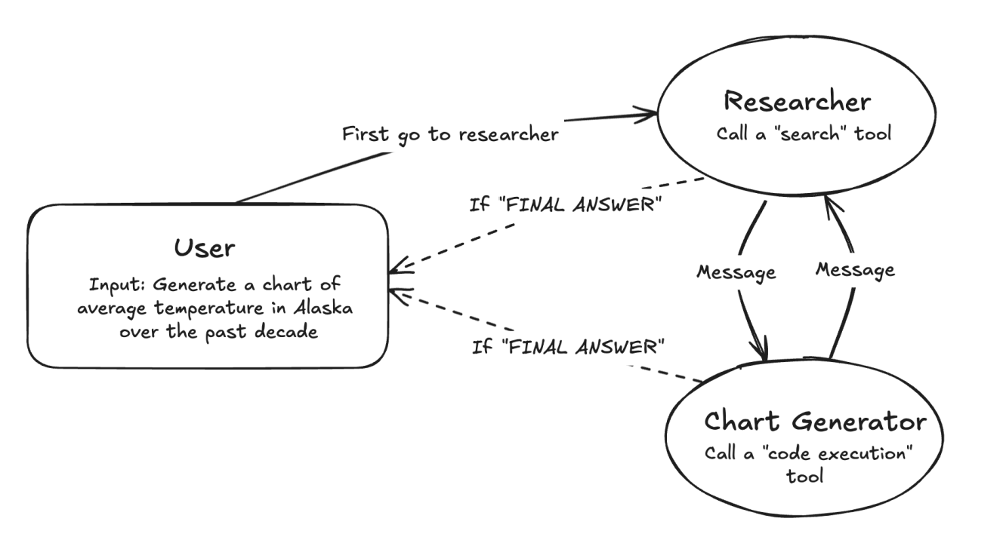

 ## AI Agent 핵심 요소
- 자연어 생성 및 이해 능력을 갖춘 LLM은 시스템의 ‘두뇌’ 역할을 합니다.
- AI가 외부 세계와 통신하거나, 데이터를 얻거나, 특정 작업을 수행해야 하는 경우 '외부 리소스'나 ‘API’를 활용할 수 있습니다. 
- 신중하게 구성된 질문이나 지시는 '프롬프트'로 제공되어 LLM의 행동과 인지 과정을 지시합니다.

- 첫 번째는 'Chain-of-Thought'입니다. (이 개념은 2022년 Google Brain 논문에서 소개됨)
	- 이 논문은 LLM이 복잡한 문제를 더 작은 중간 단계로 나눈 후, 각 단계를 연속적으로 수행하여 전체 문제를 해결할 수 있는 능력이 있음을 증명함
	- 이 기법은 Agent의 핵심인 LLM의 다단계 추론 및 계획 능력을 크게 향상시킴 
	- CoT의 복잡한 문제를 해결하기 위해 LLM이 논리적이고 순차적으로 사고하도록 장려하는 기술 - Reason and Acting

- 두 번째는 인간의 직접적인 입력 없이 'tool' + 'memory'를 사용하여 여러 작업을 연속으로 수행 
	- 'tool'은 프롬프트가 제공될 때 검색되고 사용되는 정보 저장소를 나타냄
	- 'memory'는 Agent가 과거의 프롬프트와 출력을 통해 얻은 학습된 경험을 나타냄
	- tool + memory를 통해 LLM은 설정된 목표를 완료하기 위해 자율적으로 행동할 수 있는 시스템 역할을 수행함

---

## AI agent memory

- AI 시스템의 과거 행동을 저장 및 불러오기를 하는 능력을 말함. 이를 통해 decision-making, perception, overall performance를 향상시킴
- AI agent는 memory를 통해 맥락을 유지하고, 시간이 지나면서 패턴을 인식하며, 과거 상호작용을 기반으로 적응할 수 있음
	- 예시로, 일반적인 thermostat은 단순히 현재 온도를 보고, 난방을 틀기/끄기 를 진행한다. 하지만, "smart"한 온도계는 학습된 memory를 통해 과거 및 현재의 온도를 분석하여 더 나은 의사결정을 할 수 있다.
- AI memory design's biggest challenge 중 하나는 검색 효율 최적화이다. 너무 많은 데이터를 저장하면 검색속도가 느려지기 때문에 상황에 맞는 설계가 필요

---

## Types of Agentic memory
- Short-term memory
	- remember recent inputs for immediate decision-making
	- useful in conversational AI
	- typically implemented using rolling buffer or context window (LLM이 한번에 읽을수 있는 token; LLM 자체의 임시메모리)
- Long-term memory
	- allows AI agent to store & recall across different sessions -> more personalized and intelligent over time
	- designed for permanent storage
	- implemented using db (db, graph-db, vector-db)

#### LTM types
- Episodic memory
- Semantic memory
- Procedural memory

# Types of AI Agent
- Simple reflex agent
	- operate based on direct responses to environmental conditions
	- follow predefined rules (aka condition-action rules) to make decisions without considering past experiences or future consequences.
	- ex) thermostat, automatic traffic light system
	- pro : effective in structured and predictable env
	- con : struggle in dynamic or complex scenarios. can make same mistakes over and over
- Model-based reflex agent
- Goal-based agent
- Utility-based agent
- Learning agent

---

# Multi agent

- Divide and Conquer

---

# Reference
https://www.samsungsds.com/kr/insights/integrating-ai-assistants-into-business-workflows-part1.html  
https://www.ibm.com/think/topics/ai-agent-memory  
https://www.ibm.com/think/topics/ai-agent-types  
https://langchain-ai.github.io/langgraph/tutorials/get-started/3-add-memory/#5-inspect-the-state  
https://langchain-ai.github.io/langgraph/tutorials/get-started/3-add-memory/  
https://python.langchain.com/v0.1/docs/modules/memory/  

