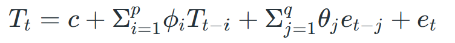
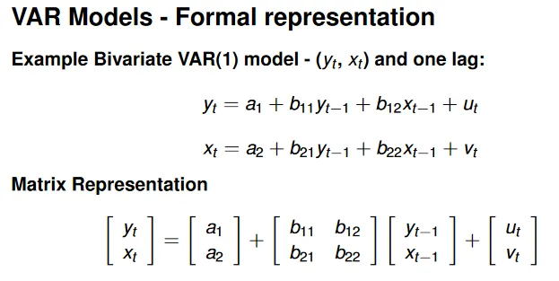

# Statistical based

## ARMA - Autoregressive Moving Average
- basic autoregressive model

## ARIMA - Autoregressive Integrated Moving Average
- simpler model with fewer parameters to estimate
  - powerful in capturing trends and short-term dependencies in data.
- 3 key components
  - Autoregression (AR) : captures the influence of series' past values on its future values. (aka, how past values affect current value)
  - Differencing (I) : it involves subtracting a previous value from the current value, often required to achieve stationarity.
    - Stationarity refers to the statistical properties of a time series, such as its mean, variance, and autocorrelation, remaining constant over time
    - Stationarity is crucial assumption for many time series analysis
  - Moving Average (MA) : accounts for the effect of past forecast errors on the current prediction. (to improve forecast accuracy)
- Use cases
  - Financial forecasting, Demand forecasting, Economic analysis, Traffic and transportation management

## SARIMA - Seasonal ARIMA
- builds upon ARIMA's strengths by incorporationg seasonality.
  - beneficial for data exhibiting recurring patterns at fixed intervals
  - has additional parameters for seasonality, which makes it less flexible.
  - using techniques like grid search or statistical tests can help identify best configuration for the data (optimizing params)
- 3 key components
  - Seasonal Autoregression : similar to AR
  - Seasonal Differencing : focuses on removing seasonal patterns from the data to acheive stationarity.
  - Seasonal Moving Average : similar to MA
- Use cases
  - Retail sales forecasting, Energy consumption prediction, Weather forecasting

## ARIMAX / SARIMAX
- ARIMA + eXogenous inputs(external factors)
- used to get deeper insights and make more accurate predictions

## Vector Autoregression
- **multivariate** extension of AR models
- VAR model considers multiple variable simultaneously, unlike traditional AR models
- assumption of : linearity, stationarity

#### Pros of ARIMA
- Simplicity : simple to understand and implement
- Versatility : applicable in various domains

#### Cons of ARIMA
- Assumption of Linearity : not always the case in real-world scenario
- Parameter selection
- Risk of overfitting (SARIMA trying to fit multiple seasonal params)

---

# Deep Learning based

## LSTM - Long Short-Term Memory
- what is it?
  - type of RNN specifically designed to handle long-term dependecies
  - unlike traditional RNNs, LSTM can retain info over long sequences -> ideal for time series forecasting
  - prevent NN output for a given input from either decaying or exploding as it cycles through the feedback loops
- Architecture
 
  - Input gate
  - Forget gate
  - Output gate
  - this architecture allows LSTM networks to selectively retain or discard info as it flows through the network to learn long-term dependencies
- Pro
  - can handle complex, nonlinear patterns
  - can model both stationary and non-stationary data
  - provides better performance compared to other RNN architectures by alleviating vanishing gradient problem
- Con
  - Computationally expensive
  - Prone to overfitting

## Attention-based RNN

---

#### References

[ARMA Time Series Model](https://www.geeksforgeeks.org/arma-time-series-model/)  
[ARIMA vs SARIMA](https://www.geeksforgeeks.org/machine-learning/arima-vs-sarima-model/)  
[ARIMA vs LSTM](https://www.geeksforgeeks.org/machine-learning/arima-vs-lstm/)  
[What is an ARIMAX Model?](https://www.geeksforgeeks.org/artificial-intelligence/what-is-an-arimax-model/)  
[Vector Autoregression (VAR)](https://www.geeksforgeeks.org/machine-learning/vector-autoregression-var-for-multivariate-time-series/)  
[LSTM](https://developer.nvidia.com/discover/lstm)  
[Research on Attention-based RNN](https://arxiv.org/abs/1704.02971)  
[review of the research above](https://simpling.tistory.com/12)  

